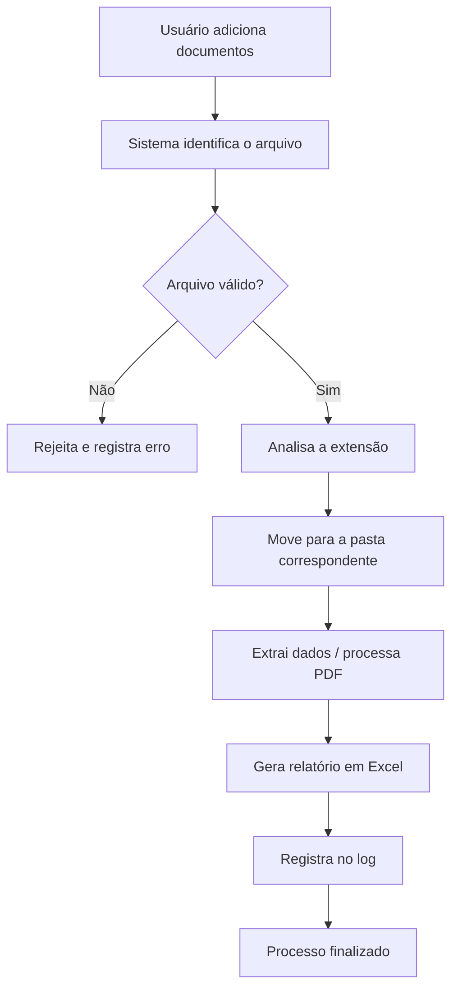

# 📂 Automação Inteligente de Gestão Documental

> Sistema modular em Python para **organização, processamento e análise automática de documentos** — com logs, configuração externa, leitura de PDFs e geração de relatórios.


---

## 🧭 Sobre o projeto

Este projeto automatiza o fluxo de trabalho de quem lida com grandes volumes de arquivos. Em vez de organizar documentos manualmente, o sistema **identifica, classifica, move e processa** cada arquivo de forma automática, registrando tudo em log e gerando relatórios ao final.

Foi construído com uma **arquitetura modular** (separação clara entre configuração, serviços e utilitários), o que torna o código fácil de manter, testar e evoluir — o mesmo padrão usado em aplicações reais de empresas.

---

## ✨ Funcionalidades

- ✅ **Organização automática** de arquivos por extensão (PDF, imagens, planilhas e outros)
- ✅ **Leitura e extração de texto de PDFs**
- ✅ **Geração de relatórios** em Excel
- ✅ **Sistema de logs** com registro de cada ação executada
- ✅ **Configuração externa** via caminhos dinâmicos (sem caminhos fixos no código)
- ✅ **Tratamento de erros** em cada etapa do processo

---

## 🏗️ Arquitetura



O fluxo segue um caminho previsível: entrada → validação → classificação → processamento → relatório → log.

---

## 🗂️ Estrutura do projeto

```
automacao-documentos-python/
│
├── src/
│   ├── main.py                  # Ponto de entrada da aplicação
│   ├── config.py                # Configuração de caminhos (entrada, saída, logs)
│   │
│   ├── services/
│   │   ├── organizador.py       # Organiza arquivos por extensão
│   │   ├── extrator_pdf.py      # Lê e extrai texto de PDFs
│   │   └── relatorio.py         # Gera relatórios em Excel
│   │
│   └── utils/
│       └── logger.py            # Sistema de logs
│
├── data/
│   ├── entrada/                 # Documentos a processar
│   └── saida/                   # Documentos organizados
│
├── logs/                        # Arquivos de log gerados
├── requirements.txt             # Dependências do projeto
├── .gitignore
└── README.md
```

---

## 🛠️ Tecnologias

| Tecnologia | Uso no projeto |
|------------|----------------|
| **Python 3.11** | Linguagem principal |
| **Pandas** | Manipulação de dados e relatórios |
| **pypdf** | Leitura e extração de texto de PDFs |
| **OpenPyXL** | Geração de arquivos Excel |
| **python-dotenv** | Gestão de variáveis de ambiente |
| **logging** | Registro de execução |

---

## 🚀 Como executar

### 1. Clone o repositório

```bash
git clone https://github.com/isacicilio/automacao-documentos-python.git
cd automacao-documentos-python
```

### 2. Crie e ative o ambiente virtual

```bash
python -m venv venv
# Windows
.\venv\Scripts\Activate.ps1
# Linux / macOS
source venv/bin/activate
```

### 3. Instale as dependências

```bash
pip install -r requirements.txt
```

### 4. Adicione documentos e execute

Coloque os arquivos que deseja organizar na pasta `data/entrada/` e rode:

```bash
python src/main.py
```

Os arquivos organizados aparecerão em `data/saida/`, e o registro da execução em `logs/`.

---

## 📈 Próximos passos

- [ ] Verificação de arquivos duplicados
- [ ] Suporte a limite de tamanho por arquivo
- [ ] Interface de linha de comando (CLI) com argumentos
- [ ] Testes automatizados
- [ ] Dashboard de visualização dos relatórios

---

## 👩‍💻 Autora

Desenvolvido por **Isa Cicílio**
[GitHub](https://github.com/isacicilio) · [LinkedIn](www.linkedin.com/in/isacicilio)

---

## 📄 Licença

Este projeto está sob a licença MIT. Sinta-se à vontade para estudar, usar e adaptar.
